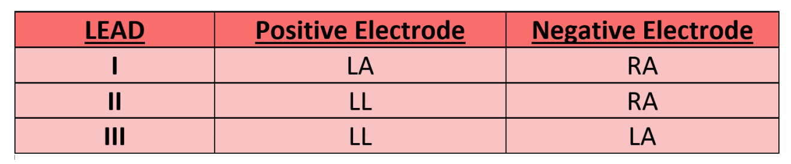

# AI-Powered-Portable-ECG-Device
This is Ai enabled ecg device which is portable and can be integrated with smartphone app to evaluate ECG of a patient.
## Features

- **Portable and easy-to-use ECG device**
- **Real-time ECG signal acquisition and analysis**
- **Microcontroller-based hardware for signal processing**
- **Software integration for detailed ECG analysis and results**
- **User-friendly interface for monitoring and reviewing results**

## Hardware Requirements

- Microcontroller ATmega328P
- ECG sensor module
- Battery pack
- Connecting wires
- Enclosure for the device

## Software Requirements

- ECG application (app-release.apk)

## Installation

### Hardware Setup

1. **Assemble the Hardware**: Connect the ECG sensor module to the microcontroller according to the sensor and microcontroller documentation.
2. **Power the Device**: Ensure the device is powered using a battery pack or USB connection.

### Software Setup

1. **Download The Application**

## Introduction
The convergence of the Internet of Things (IoT) and biomedical tools has emerged as a
transformative force in addressing healthcare challenges. One notable application is the remote
monitoring of patients, catering to diverse demographics, including the elderly and individuals
residing in remote areas. A pivotal factor in this evolution is the breakthroughs in Very Large Scale
Integration (VLSI) technology, which have led to the development of smaller, portable, low-cost
sensors. These sensors power wearable solutions capable of providing 24/7 patient monitoring,
ensuring instant responses during critical situations. The necessity of such portable, low-cost
sensors lies in their ability to make advanced healthcare accessible to a broader population,
particularly those with limited financial resources or those living far from healthcare facilities.
The seamless integration of constant internet connectivity further amplifies the benefits by enabling
real-time monitoring. This not only ensures prompt emergency responses but also facilitates the
remote monitoring of patients, thereby enhancing healthcare accessibility. This capability has
proven particularly valuable during events like the COVID-19 pandemic, where swift and remote
health assessments became imperative. Moreover, the IoT-based health monitoring paradigm
introduces a convenient alternative for health check-ups, significantly reducing the necessity for
physical doctor visits. This not only contributes to the efficiency of healthcare delivery but also
instills a sense of security among the elderly, enabling them to undergo frequent health assessments
and fostering overall well-being.
In essence, the synergy between IoT, biomedical tools, technological breakthroughs, and portable,
low-cost sensors is reshaping healthcare, making it more accessible, responsive, and tailored to the
needs of diverse patient populations.

### Motivation
The integration of remote health monitoring technologies addresses several critical scenarios in
healthcare. First and foremost, it proves invaluable in monitoring the health condition of elderly
individuals who are away from home. This capability provides a sense of reassurance for both the
elderly individuals and their families, ensuring that their well-being is continually observed even
when they are not in close proximity. Additionally, for patients situated in remote locations where
medical facilities and doctors are not readily available, remote health monitoring becomes a lifeline.
It bridges the geographical gap, allowing healthcare professionals to monitor patients and provide
timely interventions, thereby overcoming the challenges associated with limited access to medical
care.
Furthermore, in emergency situations such as accidents, where immediate on-site treatment may not
be feasible, remote health monitoring plays a pivotal role. This technology enables doctors to
monitor patients remotely, gaining crucial insights into their health status and facilitating swift
decision-making for appropriate medical interventions. This proves particularly crucial for
individuals admitted to an Intensive Care Unit (ICU) with a serious medical condition. During
emergencies, the remote monitoring process significantly eases the task of healthcare professionals
by providing continuous and real-time updates on the patient's vital signs and overall health
condition.
In addition to the general benefits of remote health monitoring, the development and deployment of
low-cost portable devices for tracking health abnormalities offer significant motivation. These
devices democratize access to advanced healthcare monitoring by making it affordable for a wider
population, including those with limited financial resources. The portability aspect ensures that
patients can continuously monitor their health regardless of their location, whether at home,
traveling, or in remote areas. This constant vigilance is crucial for early detection of health
abnormalities, enabling prompt medical attention and intervention, which can be life-saving.
In summary, the use of remote health monitoring technologies, combined with the development of
low-cost portable devices, represents a disruptive solution for improving healthcare accessibility
and emergency response mechanisms. This convergence ultimately leads to more effective and
efficient patient care, fostering a proactive approach to health management and ensuring that
individuals receive the care they need, whenever and wherever they need it.

## Methodology
An electrocardiogram (ECG) is a crucial medical diagnostic tool that plays a fundamental role in
assessing the rhythm and electrical activity of the heart. By employing sensors placed on the skin's
surface, an ECG captures and records the intricate electrical signals generated by the heart during
each heartbeat. This non-invasive procedure is instrumental in detecting and analyzing changes in
the electrical patterns, offering valuable insights into a range of cardiac conditions. ECGs are
particularly adept at identifying rhythm irregularities, insufficiencies in blood flow to the heart, and
imbalances in electrolyte levels. The comprehensive information obtained through an ECG
contributes significantly to the accurate diagnosis and subsequent management of various
cardiovascular issues, making it an indispensable tool in the field of cardiology.
The PQRST curve, often referred to as the ECG waveform or ECG complex, is a visual
representation of the electrical activity of the heart over time. It consists of several distinct waves
and intervals, each of which corresponds to a specific phase of the cardiac cycle. The primary
components of the ECG waveform are labeled as P, Q, R, S, and T waves.

**P-Wave**: The P wave is the first positive deflection on the ECG waveform. It represents the
depolarization (contraction) of the atria, the upper chambers of the heart. The P wave indicates the
initiation of the electrical impulse at the sinoatrial (SA) node and the spread of the impulse through
the atria.
**QRS Complex**: The QRS complex is a combination of three waves: Q, R, and S. It follows the P
wave and represents the depolarization of the ventricles, the lower chambers of the heart.
**Q-Wave**: The initial downward deflection after the P wave.
**R-Wave**: The first positive deflection occurred after the Q wave.
**S-Wave**: The negative deflection that follows the R wave.
**T-Wave**: The T wave is the positive deflection that follows the QRS complex. It represents the
repolarization (relaxation) of the ventricles. During the T wave, the ventricles prepare for the next
cardiac cycle.
The PQRST complex provides crucial information about the heart's electrical activity and can be
used to identify various cardiac conditions. The duration and amplitude of each wave and interval
are carefully analyzed by healthcare professionals to assess the heart's rhythm and detect
abnormalities.

**Additional Intervals:**
**PR Interval**: This interval measures the time from the beginning of the P wave to the beginning of
the QRS complex. It represents the time taken for the electrical impulse to travel from the atria to
the ventricles.
**QT Interval**: This interval extends from the beginning of the QRS complex to the end of the T
wave. It represents the total time for ventricular depolarization and repolarization.
Understanding the PQRST curve is fundamental to interpreting an electrocardiogram (ECG) and is
a key tool in diagnosing various cardiac conditions, including arrhythmias, conduction
abnormalities, and ischemia.
### Normal heart rhythm vs abnormal heart rhythm
The heart's rhythm is a carefully orchestrated sequence of electrical impulses that ensures effective
and efficient pumping of blood throughout the body. A normal heart rhythm, also known as sinus
rhythm, is characterized by a regular and coordinated pattern of electrical signals originating from
the sinoatrial (SA) node, the heart's natural pacemaker. This rhythmic pattern facilitates the
synchronized contraction of the atria and ventricles, maintaining optimal blood circulation.
Conversely, various abnormalities in heart rhythm, or arrhythmias, can disrupt this harmonious
process. Arrhythmias can be broadly categorized into two main types: tachyarrhythmias and
bradyarrhythmias. Tachyarrhythmias involve abnormally fast heart rates, while bradyarrhythmias
involve unusually slow heart rates.

**Common types of arrhythmias include:**
**Atrial Fibrillation (AF):** This is a common tachyarrhythmia where the atria quiver instead of
contracting effectively, leading to an irregular and often rapid heartbeat.
**Atrial Flutter:** Similar to AF, but with a more organized and regular pattern of abnormal atrial
contractions.
**Supraventricular Tachycardia (SVT):** A rapid heart rate originating above the heart's ventricles,
often causing palpitations.
**Ventricular Tachycardia (VT):** A fast, regular beating of the heart's lower chambers (ventricles),
which can be life-threatening.
**Ventricular Fibrillation (VF):** A chaotic, rapid heartbeat originating in the ventricles is a medical
emergency requiring immediate intervention.
**Bradycardia:** A slower-than-normal heart rate, often due to issues with the heart's electrical
conduction system.
**Heart Block:** A condition where the electrical signals between the atria and ventricles are delayed
or blocked.

***3 lead configuration***
The 3-lead ECG configuration is a simplified yet effective method for monitoring the heart's
electrical activity. This setup uses three electrodes placed on the patient's body to capture the
electrical signals generated by the heart. Typically, the electrodes are positioned as follows: one on
the right arm (RA), one on the left arm (LA), and one on the left leg (LL). This arrangement forms
the basis of Einthoven's triangle, which allows for the measurement of electrical activity from
different perspectives.
In the 3-lead configuration, the leads are named Lead I, Lead II, and Lead III:
● Lead I measures the voltage difference between the right arm and left arm.
● Lead II measures the voltage difference between the right arm and left leg.
● Lead III measures the voltage difference between the left arm and left leg.
By capturing signals from multiple perspectives, the 3-lead configuration enhances the accuracy
and reliability of ECG readings, making it a valuable tool in both clinical and remote monitoring
settings.

**Advantages of 3-Lead Configuration Over Single-Lead Configuration:**
● Captures a more comprehensive view of the heart's electrical activity from multiple angles,
improving diagnostic precision.
● Better at detecting cardiac abnormalities such as arrhythmias and ischemia that might be missed
with a single lead.
● Provides redundancy, if one lead fails, the other leads can still offer crucial information, ensuring
continuous monitoring.
● Reduces interference and noise, resulting in higher quality ECG recordings.

### System Architecture
The system architecture of our ECG monitoring solution encompasses a seamless integration of
hardware and software components to ensure efficient signal acquisition, processing, and analysis.
At the core of our architecture lies the ECG sensor, responsible for detecting electrical signals
generated by the heart. The raw analog signal from the sensor is then digitized by a microcontroller
unit (MCU), facilitating real-time data processing and transmission.
From the MCU, the digitized ECG data is transmitted to a smartphone using a USB-C type cable,
establishing a reliable communication link between the monitoring device and the user's mobile
device. Leveraging the USB-C interface ensures high-speed data transfer and compatibility with
modern smartphone platforms.
Upon receiving the ECG data, the smartphone app takes charge of signal processing and analysis.
The raw data undergoes digital filtering using a Butterworth filter, designed to suppress noise and
artifacts while preserving the essential features of the ECG waveform. This filtering step enhances
the quality and clarity of the ECG signal, preparing it for subsequent analysis.
Subsequently, the Pan-Tompkins algorithm, a robust QRS detection algorithm, is applied to the
filtered ECG signal. This algorithm accurately identifies the QRS complexes, representing the
electrical activity associated with ventricular depolarization, and extracts relevant time intervals
crucial for cardiac assessment.

### Electrode Placement on the Human Body:
The process begins with the placement of electrodes on the human body. Electrodes are
strategically positioned in specific locations, such as the chest, limbs, and other areas, to capture
electrical signals generated by the heart during its activity.
**AD8232 Sensor:**
The electrodes are connected to an Analog Front End (AFE) device, such as the AD8232 sensor.
The AD8232 is a dedicated integrated circuit designed for biopotential signal acquisition, including
ECG signals. It amplifies and filters the weak electrical signals picked up by the electrodes,
ensuring a clear and reliable ECG signal.
**Microcontroller Unit (MCU):**
The processed signals from the AD8232 sensor are then transmitted to a Microcontroller Unit
(MCU). The MCU acts as the central processing unit, responsible for managing and coordinating
the flow of data within the system through a C-Type cable connected to a smartphone. It may also
perform initial signal-processing tasks.
**Smartphone:**
The MCU will send this raw data to the smartphone via a C-type cable, where it will be received
and handled by specialized software. Our method shifts the computational weight to the smartphone
by utilizing its flexibility and processing power, in contrast to conventional ECG monitoring
systems that carry out signal processing within the hardware.
We can accomplish effective data processing while preserving portability and user-friendliness by
integrating signal filters and analysis algorithms directly on the smartphone. This design decision
reduces the hardware specifications while enabling dynamic updates and customization via
software changes on the smartphone platform.
**Result:**
The processed ECG data is then used to generate results. These results may include the
identification of normal or abnormal heart rhythms, detection of arrhythmias, and other relevant
diagnostic information. The results can be stored in the cloud for further analysis, shared with
healthcare professionals, or integrated into electronic health records.
This architecture allows for remote monitoring and real-time analysis of ECG signals, enabling
timely intervention and medical support if any abnormalities are detected. It combines the benefits
of sensor technology, microcontroller processing, wireless communication, and cloud computing to
create a comprehensive ECG monitoring system.

## Electrode Placement and Einthoven’s Triangle
When recording electrocardiogram (ECG) signals, electrode location is critical since it directly
affects the precision and quality of the recorded data. The ideal electrical contact with the skin is
achieved by precisely situating electrodes on the body, which reduces artifact and interference and
allows for the detection of cardiac electrical activity. Accurate ECG waveforms are necessary for
the detection and interpretation of cardiac diseases, and they are made easier to collect when
electrodes are positioned correctly. ECG tracings can be distorted due to improper placement or
inadequate skin-to-electrode contact, which can cause baseline drift, noise, and signal attenuation.
This can lead to incorrect interpretation and possibly misdiagnosis. Furthermore, longitudinal
monitoring and the analysis of ECG patterns over time depend on consistent electrode placement
across multiple recordings.
Cardinal limb leads create an equilateral triangle when determining the electrical axis of the heart,
according to Willem's discoveries. The right arm, left arm, and left leg are connected to the
equilateral triangle structure. This arrangement creates a circuit around the heart.
There are three lead systems that work together to use for the ECG which are:
● Standard Limb Leads
● Augmented Limb Leads
● Precordial Leads
### Standard Limb Leads (bipolar) I, II & III
To demonstrate the potential difference between two limbs at once, where one limb is carrying a
positive electrode and the other a negative electrode, these are employed. The right arm (RA), left
arm (LA), and left leg (LL) are the three limb electrodes, I, II, and III, forming a triangle.

Einthoven's law simplifies the understanding of lead relationships within the ECG triangle,
allowing for the computation of one lead's value if the values of the other two are known. Lead I
measures the potential difference between the left and right shoulders, providing an orientation
angle of 0°. Lead II, with an orientation angle of more than 60 degrees, captures the electrical
activity from the right arm to the left leg. Lead III, oriented at +120 degrees, records the potential
difference between the left shoulder and one of the legs. The placement of electrodes on the limbs
has negligible impact on ECG recording, with the right leg electrode minimizing interference
without affecting outcomes. Each lead effectively captures the heart's electric field during
depolarization and repolarization, quantified by voltage differences between electrodes.

### Experimentation With Standard Device Scintech 2531

#### Lead 1:

#### Lead 2:

#### Lead 3:

### ECG Device using AD8232 sensor

We employed the AD8232 sensor to capture electrocardiogram (ECG) signals, which were then
interfaced with an Arduino Uno microcontroller board for data sampling and processing. The
AD8232 sensor is specifically designed for ECG signal acquisition, featuring high input impedance
and built-in instrumentation amplifiers to ensure accurate measurement of cardiac electrical activity.
Once the ECG signals were acquired by the AD8232 sensor, they were processed by the Arduino
Uno board using the onboard Analog-to-Digital Converter (ADC) to digitize the analog signals. The
Arduino Uno, programmed to sample and process the ECG data, facilitated real-time monitoring
and analysis of cardiac activity.
To transfer the sampled ECG data from the Arduino Uno to a smartphone for further analysis, we
utilized a USB C to B cable for communication between the Arduino Uno and the smartphone. The
USB C to B cable provided a reliable physical connection, enabling data transmission between the
two devices.
For the communication protocol, we employed UART (Universal Asynchronous
Receiver-Transmitter) protocol, a popular serial communication protocol used for transferring data
between devices. UART communication allows for asynchronous data transmission, where data is
sent in a sequential fashion without requiring a clock signal. This protocol facilitated the transfer of
ECG data from the Arduino Uno to the smartphone in a standardized and efficient manner.
Overall, by integrating the AD8232 sensor with the Arduino Uno microcontroller board and
employing UART communication via a USB C to B cable, we were able to capture, process, and
transmit ECG data from the sensor to a smartphone for real-time monitoring and analysis of cardiac
activity. This approach provided a versatile and portable solution for ECG monitoring, with the
potential for use in various healthcare and telemedicine applications.

## Software Implementation
### Filter:
We utilized a digital filtering technique to refine the quality and precision of the electrocardiogram
(ECG) signals captured by the AD8232 sensor. Acknowledging the presence of various sources of
noise in the acquired ECG data, such as baseline wander, power line interference, and muscle
artifacts, we implemented a 3rd order Butterworth bandpass filter to selectively attenuate
frequencies outside the desired range. Specifically, we designed the bandpass filter with cutoff
frequencies of 0.5 Hz and 99.5 Hz, effectively suppressing low-frequency baseline drift and
high-frequency noise while preserving the essential components of the ECG waveform. The
utilization of a 3rd order Butterworth filter ensured a balance between effective noise suppression
and minimal distortion of the desired ECG signal. Renowned for its maximally flat frequency
response in the passband and steep roll-off in the stopband, the Butterworth filter offered superior
performance in terms of signal fidelity and distortion reduction. By applying this advanced filtering
technique to the raw ECG signals, we successfully mitigated noise artifacts and improved the
clarity and reliability of the recorded ECG tracings. This digital filtering approach, featuring a 3rd
order Butterworth filter, not only enhanced the diagnostic utility of the ECG data but also
contributed to the overall accuracy and effectiveness of our monitoring system.
### Algorithm:
The algorithm operates by first employing a bandpass filter to isolate the QRS complexes from the
raw ECG signal, effectively removing unwanted noise and artifacts. Subsequently, it utilizes a
differentiated signal to enhance the sharp transitions characteristic of QRS complexes. Then, a
squaring operation is applied to amplify the QRS complexes' amplitude, making them more
distinguishable from background noise.

### Application Interface:
Integrating a smartphone application into our project offers several significant advantages and
enhances the overall functionality and usability of our ECG monitoring system.
Firstly, the smartphone app provides a user-friendly interface for data visualization and analysis,
allowing users to conveniently view real-time ECG waveforms, heart rate trends, and other vital
statistics directly on their mobile devices. This empowers users to monitor their cardiac health
conveniently and proactively, without the need for specialized equipment or extensive training.
Additionally, the app facilitates seamless data transmission and sharing, enabling users to
effortlessly transfer ECG recordings from the Arduino-based monitoring device to their
smartphones for further analysis or consultation with healthcare professionals. This promotes
remote monitoring and telemedicine applications, particularly in situations where access to medical
facilities or expertise may be limited.
Furthermore, the smartphone app can serve as a centralized platform for storing and managing ECG
data, providing users with a comprehensive record of their cardiac activity over time. This
longitudinal data tracking is invaluable for tracking changes in heart health, identifying potential
abnormalities, and monitoring the effectiveness of treatment interventions.
Overall, the smartphone app enhances the accessibility, functionality, and utility of our ECG
monitoring system, making it an indispensable tool for individuals seeking to monitor and manage
their cardiac health effectively in both clinical and everyday settings.

## Result
### Electrode Placed on a patient body:

### Application Interface:

### Outcome:

Heart Rate = 60/RR interval(in sec) =60/0.834 = 71.94 ~ 72 bpm (approx)
Normal BPM= 60-90 bpm
Hence, this heart rhythm is in the normal range.

## Conclusion And Future Work
In conclusion, our project successfully achieved the primary objectives of transferring
electrocardiogram (ECG) data from a microcontroller unit (MCU) to a smartphone and
implementing the Pan-Tompkins algorithm for QRS peak detection. Through meticulous design and
integration, we established a robust communication link between the MCU and smartphone,
facilitating the real-time transmission of ECG data for monitoring and analysis.
By applying the algorithm, we effectively detected QRS peaks in the ECG signals,
enabling the accurate calculation of various time intervals crucial for cardiac assessment. We
meticulously validated our results against standard data, ensuring the reliability and accuracy of our
algorithmic approach.
Our project's success highlights the potential of leveraging modern technology, such as smartphones
and microcontrollers, to develop innovative solutions for healthcare monitoring and diagnosis. The
seamless integration of hardware and software components, coupled with advanced signal
processing techniques, demonstrates the feasibility and efficacy of our approach in facilitating
remote ECG monitoring and analysis.
### Future Work
In future work, Aim to explore several avenues to further enhance the functionality and
effectiveness of our ECG monitoring system. First plan is to develop an algorithm capable of
dynamically adjusting the window length for QRS complex detection based on signal
characteristics. By leveraging machine learning techniques, such as neural networks or decision
trees, we can train the algorithm to adaptively modify the window length in response to variations
in signal quality, noise levels, and physiological conditions. This adaptive approach will improve
the robustness and accuracy of QRS complex detection, particularly in challenging environments or
for individuals with unique cardiac profiles.
Additionally, we intend to implement a system for transmitting the filtered ECG signal and
extracted features to a centralized server for further processing and machine learning classification.
By offloading computationally intensive tasks to a remote server, we can leverage advanced data
analytics techniques and large-scale machine learning models to analyze ECG data
comprehensively. This centralized approach enables real-time monitoring of cardiac health, early
detection of abnormalities, and personalized risk assessment, paving the way for more proactive
and preventive healthcare interventions.
Furthermore, investigation is required to enhance the efficiency and accuracy of signal processing,
with a particular focus on timely detection and response to cardiac abnormalities. This may involve
exploring advanced signal processing algorithms, such as wavelet transforms or adaptive filtering
techniques, to improve noise reduction and feature extraction capabilities. Additionally, we will
explore novel approaches for integrating real-time feedback mechanisms into our system, enabling
adaptive adjustment of monitoring parameters based on emerging trends or anomalous patterns in
the ECG data. By continually refining and optimizing our signal processing techniques, we can
ensure the reliability, responsiveness, and clinical relevance of our ECG monitoring system in
diverse healthcare scenarios.

